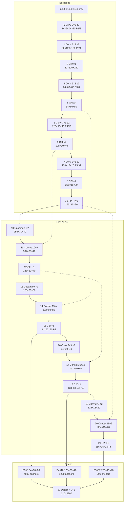

# PartialPersonDetection

灰度 **640×480** 视频里判断画面是否有人（含边缘截断的半身/局部人体），输出 **有人 / 没人**。

## 模型架构 `configs/yolov8n-gray.yaml`

相对标准 YOLOv8n 的改动：

| 项 | 标准 YOLOv8n | 本仓库 |
|----|----------------|--------|
| 输入 | RGB 3 通道，常按 640×640 letterbox | **1 通道灰度**，原生 **640×480**（`imgsz: [480, 640]` + `rect`） |
| 检测头 | P3 / P4 / P5（stride 8/16/32） | 同左 **P3 / P4 / P5**（去掉 P2，降低 120×160 激活占用） |
| 类别 | COCO 80 类 | 单类 `person` |

640×480 可被 stride 32 整除。形状为 **batch × C × H × W**（batch=1 时省略 batch）。3.01 M 参数，6.0 GFLOPs。最大激活是 stem `16×240×320`（FP32 4.69 MB）。



虚线为 Concat 跨层连接。Detect 三头 4800+1200+300 = **6300**，输出 `xywh` + `person`。

| Scale | Stride | Feature | Anchors | Detect 输入 | Box / cls |
|---|---|---|---|---|---|
| P1 | 2 | `16×240×320` | — | — | stem only |
| P2 | 4 | `32×120×160` | — | — | 无检测头（已去掉） |
| P3 | 8 | `64×60×80` | 4800 | `64×60×80` | cv2 64→64，cv3 64→1 |
| P4 | 16 | `128×30×40` | 1200 | `128×30×40` | cv2 128→64，cv3 128→1 |
| P5 | 32 | `256×15×20` | 300 | `256×15×20` | cv2 256→64，cv3 256→1 |

### 每一层维数

激活按 batch=1、FP32（4 bytes）。INT8 约为表中的 1/4。

| # | Op | From | C×H×W | Stride | Act FP32 | Params | 备注 |
|---|---|---|---|---|---|---|---|
| in | Input | — | `1×480×640` | 1 | 1.172 MB | 0 | 灰度 /255，BCHW |
| 0 | Conv 3×3 s2 | in | `16×240×320` | 2 | 4.688 MB | 176 | P1/2 stem |
| 1 | Conv 3×3 s2 | 0 | `32×120×160` | 4 | 2.344 MB | 4,672 | P2/4 |
| 2 | C2f ×1 | 1 | `32×120×160` | 4 | 2.344 MB | 7,360 | Bottleneck 16→16 |
| 3 | Conv 3×3 s2 | 2 | `64×60×80` | 8 | 1.172 MB | 18,560 | P3/8 |
| 4 | C2f ×2 | 3 | `64×60×80` | 8 | 1.172 MB | 49,664 | 跳到 #14 |
| 5 | Conv 3×3 s2 | 4 | `128×30×40` | 16 | 0.586 MB | 73,984 | P4/16 |
| 6 | C2f ×2 | 5 | `128×30×40` | 16 | 0.586 MB | 197,632 | 跳到 #11 |
| 7 | Conv 3×3 s2 | 6 | `256×15×20` | 32 | 0.293 MB | 295,424 | P5/32 |
| 8 | C2f ×1 | 7 | `256×15×20` | 32 | 0.293 MB | 460,288 | |
| 9 | SPPF k=5 | 8 | `256×15×20` | 32 | 0.293 MB | 164,608 | 跳到 #10、#20 |
| 10 | Upsample ×2 | 9 | `256×30×40` | 16 | 1.172 MB | 0 | nearest |
| 11 | Concat | 10+6 | `384×30×40` | 16 | 1.758 MB | 0 | 256+128 |
| 12 | C2f ×1 | 11 | `128×30×40` | 16 | 0.586 MB | 148,224 | 跳到 #17 |
| 13 | Upsample ×2 | 12 | `128×60×80` | 8 | 2.344 MB | 0 | nearest |
| 14 | Concat | 13+4 | `192×60×80` | 8 | 3.516 MB | 0 | 128+64 |
| 15 | C2f ×1 | 14 | `64×60×80` | 8 | 1.172 MB | 37,248 | Detect P3 |
| 16 | Conv 3×3 s2 | 15 | `64×30×40` | 16 | 0.293 MB | 36,992 | PAN 下行 |
| 17 | Concat | 16+12 | `192×30×40` | 16 | 0.879 MB | 0 | 64+128 |
| 18 | C2f ×1 | 17 | `128×30×40` | 16 | 0.586 MB | 123,648 | Detect P4 |
| 19 | Conv 3×3 s2 | 18 | `128×15×20` | 32 | 0.146 MB | 147,712 | PAN 下行 |
| 20 | Concat | 19+9 | `384×15×20` | 32 | 0.439 MB | 0 | 128+256 |
| 21 | C2f ×1 | 20 | `256×15×20` | 32 | 0.293 MB | 493,056 | Detect P5 |
| 22 | Detect + DFL | 15,18,21 | `5×6300` | 8/16/32 | 0.120 MB | 751,507 | ONNX `output0` = `1×5×6300` |

Detect 每个尺度两路：回归 `cv2`（DFL 16 bin × 4 边 = 64 通道）和分类 `cv3`（1 类）。DFL 把 64 通道收成 xywh，再与分数拼成 5×N。

第一层从 RGB 预训练 `weights/yolov8n.pt` 把 3 通道卷积按通道平均迁到 1 通道。不要用 P6（480 不能被 64 整除）。
发布权重：`weights/yolo_gray_640_480.pt`、`weights/yolo_gray_640_480.onnx`；上板 INT8：`weights/yolo_gray_640_480_int8.om`（需配合 `yolo_gray_640_480_compress_param`）。

## 训推流程

```
data/raw/coco          原始 COCO 2017
       │
       ▼  prepare_data.py
data/gray              640×480 灰度缓存
       │  + 截断人体增强
       ▼
data/person            训练/验证集（person.yaml，channels: 1）
       │
       ▼  train.py  ← configs/train.yaml
runs/yolo_gray_640_480/  训练日志
weights/yolo_gray_640_480.pt    发布权重
weights/yolo_gray_640_480.onnx  发布 ONNX（1×1×480×640 → 1×5×6300）
       │
       ▼  infer.py --source 图/目录/视频
有人 / 没人            默认 conf=0.03
runs/predict/occupancy/
```

1. **数据** `python3 prepare_data.py`  
   把 COCO 转到 640×480 灰度，只保留 `person` 框，并生成截断半身样本，写入 `data/person`。  
   已有灰度缓存时：`python3 prepare_data.py --skip-convert`。  
   冒烟：`python3 prepare_data.py --debug` → `data/person_debug`。

2. **训练** `python3 train.py`  
   读 `configs/train.yaml`：架构 `yolov8n-gray.yaml`，50 epoch，batch 128，输入 `[480, 640]`。  
   权重默认写到 `runs/yolo_gray_640_480/weights/best.pt`。发布用：拷到 `weights/yolo_gray_640_480.pt`。

3. **推理** `python3 infer.py --source your.mp4`  
   默认 `weights/yolo_gray_640_480.pt`，`imgsz [480, 640]`，`--conf 0.03`（精确率/召回较均衡）。  
   可视化与 JSON：`runs/predict/occupancy/`。

一键：

```bash
python3 -m pip install -r requirements.txt
python3 run_pipeline.py                  # 数据 → 训练 → 验证集推理
python3 infer.py --source your.mp4
```

已有数据和权重时：

```bash
python3 train.py --epochs 50 --device 0
python3 infer.py --weights weights/yolo_gray_640_480.pt --conf 0.03 --source your.mp4
```
